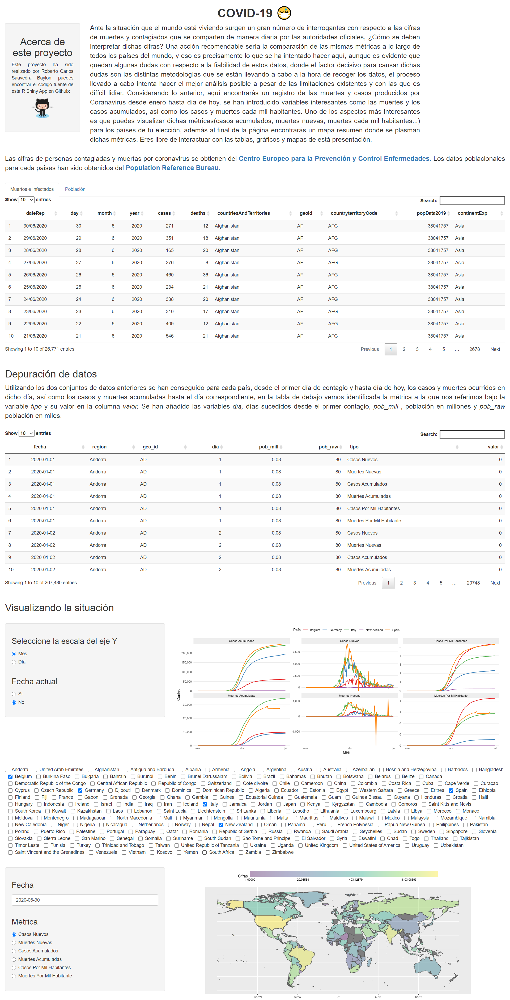

# covid
This project has been created looking toward explorer the R Shiny environment while gaining insights about the 
Covid-19 outbreak, you can check the result at https://robertosaavedra.shinyapps.io/COVID/, the code is at covid.R, due to 
data cleaning carried out the application could take a while to open(~2min) 

